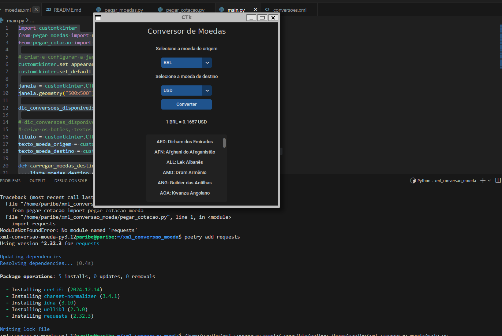

# Conversor de Moedas

## Descrição

Este projeto é um aplicativo GUI (Interface Gráfica do Usuário) desenvolvido em Python utilizando o módulo `customtkinter`. Ele permite que os usuários:

- Visualizem uma lista de moedas disponíveis.
- Selecionem uma moeda de origem e uma moeda de destino.
- Obtenham a cotação atual para conversão entre as moedas selecionadas.

O programa carrega as informações de moedas e suas cotações a partir de arquivos XML.

---

## Funcionalidades

1. **Exibição de Moedas Disponíveis**:
   - Mostra uma lista de moedas disponíveis para conversão, incluindo seus códigos e nomes.

2. **Seleção de Moedas**:
   - Permite selecionar uma moeda de origem.
   - Atualiza automaticamente as opções de moedas de destino com base na moeda de origem selecionada.

3. **Conversão de Moeda**:
   - Realiza a conversão entre a moeda de origem e a moeda de destino, exibindo a cotação atual.

4. **Interface Dark Mode**:
   - Interface amigável configurada no modo escuro.

---

## Dependências

Certifique-se de que você tem as seguintes dependências instaladas:

- Python 3.12+
- `customtkinter` (instalado via `poetry` ou `pip`)

### Instalação das dependências

Se estiver usando o `poetry`:
```bash
poetry add customtkinter
```

Se estiver usando o `pip` diretamente:
```bash
pip install customtkinter
```

Além disso, para rodar o programa, o módulo `tkinter` deve estar instalado no sistema. Em distribuições Linux, você pode instalá-lo com o seguinte comando:

#### Para Ubuntu/Debian:
```bash
sudo apt install python3-tk
```

#### Para Fedora:
```bash
sudo dnf install python3-tkinter
```

---

## Como executar o projeto

1. Clone o repositório para o seu computador:
```bash
git clone <url-do-repositorio>
```

2. Entre no diretório do projeto:
```bash
cd xml_conversao_moeda
```

3. Ative o ambiente virtual (se aplicável):
```bash
source .venv/bin/activate
```

4. Execute o script principal:
```bash
python main.py
```

---

## Estrutura do Projeto

```
xml_conversao_moeda/
├── main.py                # Script principal
├── pegar_moedas.py        # Funções para carregar moedas e suas cotações
├── pegar_cotacao.py       # Função para obter cotação atual de uma moeda
├── README.md              # Documentação do projeto
├── .venv/                 # Ambiente virtual (opcional)
└── arquivos_xml/          # Arquivos XML com dados de moedas e cotações
```

---

## Uso do programa

- Abra a interface gráfica e selecione as moedas de origem e destino.
- Clique no botão **Converter** para visualizar a cotação atual.
- A lista de moedas disponíveis é exibida no painel inferior da interface.

---

## Contribuição

Sinta-se à vontade para contribuir com melhorias ao projeto. Para contribuir:

1. Faça um fork do repositório.
2. Crie uma nova branch:
   ```bash
   git checkout -b minha-feature
   ```
3. Envie suas alterações:
   ```bash
   git add .
   git commit -m "Descrição da feature"
   git push origin minha-feature
   ```
4. Abra um Pull Request.

---

## Licença

Este projeto é licenciado sob a [MIT License](https://opensource.org/licenses/MIT).


# Tela 




